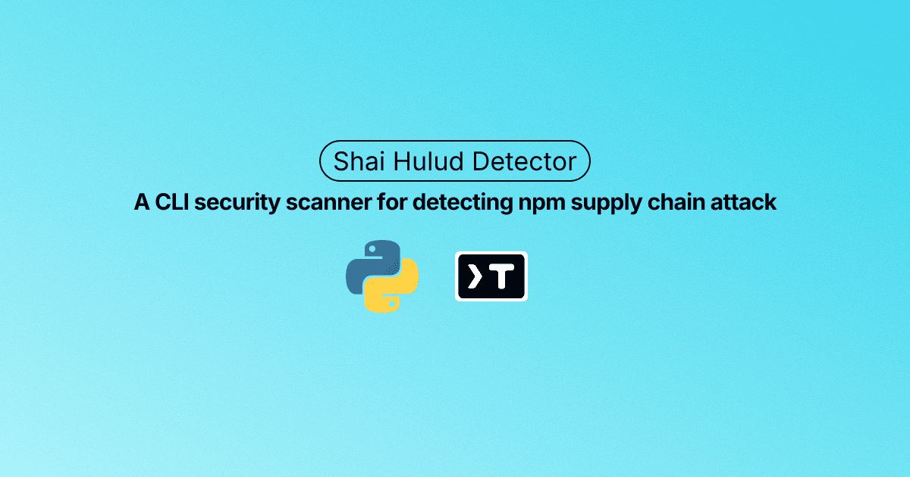

# Shai Hulud Detector


[](https://pypi.org/project/shai-hulud-detector/)

A CLI tool to detect potential Shai Hulud npm-worm compromises in GitHub users and organizations.



## What is Shai Hulud?

Shai Hulud is a self-replicating npm worm that spreads through compromised developer systems,
infecting GitHub repositories and injecting malicious code.  
It has already been linked to multiple global supply-chain attacks targeting major npm libraries.

This tool scans for known indicators of compromise (IOCs), including:

- Suspicious repository descriptions containing  
  **`"Sha1-Hulud: The Second Coming."`**
- Presence of suspicious JSON files containing secrets, credentials or environment configuration

## Features

- Scan individual GitHub users
- Scan all members of a GitHub organization
- Dual detection methods: repository description patterns and suspicious file detection
- Concurrent scanning with configurable workers
- Color-coded output for easy identification (FLAG/OKAY/ERROR status)
- Detailed verbose mode

## Requirements

- Python 3.11+
- GitHub Personal Access Token (https://github.com/settings/tokens)

## Installation

Install directly from PyPI:

```bash
pip install shai-hulud-detector
```

## Authentication

Set your GitHub token as an environment variable (recommended):

```bash
export GITHUB_TOKEN=<GITHUB_TOKEN_HERE>
```

Or pass it via command-line flag (see Usage section below). If omitted, the tool exits with a clear warning.

## Usage

### Scan one or more users

```bash
shai-hulud-detector scan <USERNAME_HERE>
shai-hulud-detector scan <USERNAME_HERE1> <USERNAME_HERE2> <USERNAME_HERE3>
```

### Scan all members of an organization

```bash
shai-hulud-detector scan --org <ORGANIZATION_NAME_HERE>
```

### Authentication via command-line

```bash
shai-hulud-detector scan <USERNAME_HERE> --token <GITHUB_TOKEN_HERE>
```

### Help

```bash
shai-hulud-detector scan --help
```

### Parallelism

Set concurrency (default 5):

```bash
shai-hulud-detector scan --org <ORGANIZATION_NAME_HERE> --workers 10
```

### Verbose Output

```bash
shai-hulud-detector scan <USERNAME_HERE> --verbose
```

### Recommended Actions

If you detect a compromise (FLAG status):

- Rotate **all** GitHub, npm, cloud, and CI/CD secrets
- Enforce MFA on GitHub & npm accounts
- Check GitHub for repositories with the description "Sha1-Hulud: The Second Coming."
- Review and remove any suspicious files found (e.g., `secrets.json`, `credentials.json`, etc.)
- Disable npm `postinstall` scripts in CI where possible
- Audit all npm dependencies and versions

### References

For more detailed information about Shai Hulud attacks, see:

- [HelixGuard: Malicious Sha1Hulud Analysis](https://helixguard.ai/blog/malicious-sha1hulud-2025-11-24)
- [Aikido Security: Shai Hulud Strikes Again](https://www.aikido.dev/blog/shai-hulud-strikes-again-hitting-zapier-ensdomains)
- [Wiz: Shai Hulud 2.0 Ongoing Supply Chain Attack](https://www.wiz.io/blog/shai-hulud-2-0-ongoing-supply-chain-attack)

## License

MIT License - see [LICENSE](LICENSE) file for details.

## Author

**Y. Siva Sai Krishna**

- GitHub: [@ysskrishna](https://github.com/ysskrishna)
- LinkedIn: [ysskrishna](https://linkedin.com/in/ysskrishna)

## Development

For development setup, building, and contributing, see [DEVELOPMENT.md](https://github.com/ysskrishna/shai-hulud-detector/blob/main/DEVELOPMENT.md).

## Changelog

See [CHANGELOG.md](https://github.com/ysskrishna/shai-hulud-detector/blob/main/CHANGELOG.md) for a detailed list of changes and version history.

## Releases

For information on the release process and how to create new releases, see [RELEASE.md](https://github.com/ysskrishna/shai-hulud-detector/blob/main/RELEASE.md).

## Contributing

Contributions are welcome! Please feel free to submit a Pull Request.

## Issues

If you encounter any issues or have feature requests, please open an issue on [GitHub](https://github.com/ysskrishna/shai-hulud-detector/issues).
